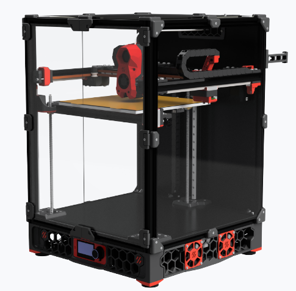

## 什么是 VORON（沃龙）

VORON（沃龙）是一个专注于 3D 打印机方案设计的开源项目。其目标是创造出性能优秀、使用稳定、价格适宜并且个人可组装的家用 3D 打印机。项目诞生于 2015 年，经过持续不断地开发与优化，VORON（沃龙）家族现已有 Voron Zero、Voron Trident、Switchwire、Voron 2 和 Legacy 在内的多个型号用以满足不同的使用需求。

## 什么是 Voron Trident（沃龙三叉戟）

Voron Trident（沃龙三叉戟）是一种基于 CoreXY 固定龙门架和 Z 轴可移动热床的 3D 打印机结构。其热床通过 3 个丝杆固定和移动，故称“三叉戟”。

## Voron Trident（沃龙三叉戟）的产品特色

- 封闭结构，支持高温打印。
- 支持 3 种标准尺寸的构建：250x250x300mm、300x300x300mm 和 350x350x300mm（Z 轴高度由丝杆电机决定）。
- 结构相对简单，采购与维护成本更有优势。

相较于 Voron Zero：Voron Trident（沃龙三叉戟）三维尺寸更大，意味着能够打印更大的物品。没有为小型化做过多妥协，代表其拥有更强大的打印性能。

相较于 Voron 2：采用固定龙门架与移动热床的设计使得Voron Trident（沃龙三叉戟）结构更加简单，在采购成本与安装维护上更具优势。
