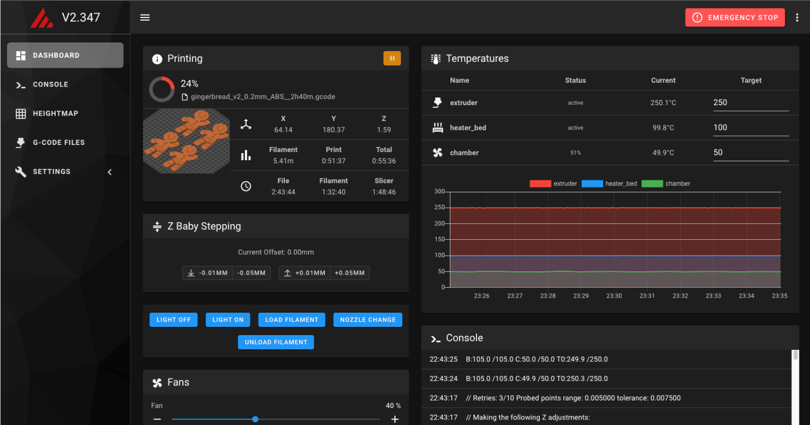
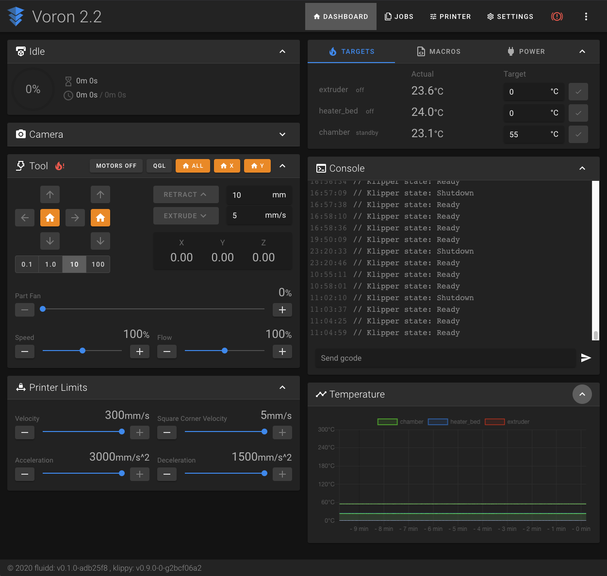
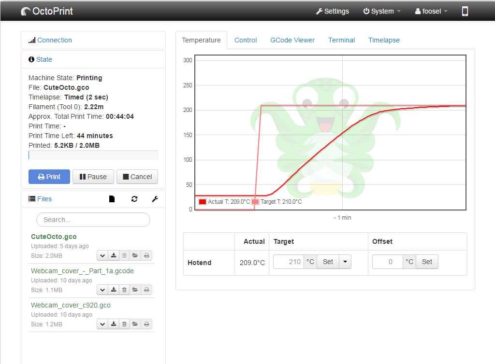

## 上位机固件安装

VoronTrident 打印机由 [Klipper](https://klipper3d.com/) 固件驱动，并提供了三种不同的 Web 界面以供您管理打印机。

### Mainsail



Mainsail 是一个为 Klipper 及其他子系统设计的驱动固件，并提供轻量级 Web 管理界面，但不支持插件的安装与使用（通常也并不需要）。

#### Mainsail 安装步骤

1. 固件下载与刷写：
   1. 下载并安装 [pi-imager](https://www.raspberrypi.com/software/)
   2. 打开 pi-imager 软件，单击“选择操作系统”并向下滚动到“其他特定用途操作系统”。
   3. 选择“3D打印”并选择“MainsailOS”。
   4. 将您的 SD 卡插入电脑，并在 pi-imager 软件中选择您的 SD 卡。
   5. 如果您要使用 Wi-Fi，请单击右下角的 GEAR 图标并输入您的 Wi-Fi 信息。
   6. 单击“保存”和“写入”。请注意，这将毁掉您卡上的所有数据！
2. 访问 Web 管理界面：
   1. 确保您的 MCU 已连接到您的树莓派设备。如果您使用的是有线网络，还请确保您的以太网电缆已连接。
   2. 将 SD 卡插入树莓派，然后打开树莓派的电源。
   3. 在网络上找到您的树莓派的 IP 地址，然后通过 SSH 进入它（在 Windows 上使用 PuTTY 或在 MacOS 上使用终端）。默认用户名是`pi`，密码是`raspberry`。
      - 如果您的网络支持 bonjour，则 pi 应显示为mainsailos.local
      - 如果您的网络自动分配 DNS 主机名，它可能会简单地显示为mainsailos
      - 如果这两个选项都失败，您可能需要检查路由器的 DHCP 服务器，并找出分配给设备的 IP 地址。

在安装 Mainsail 系统并进入 Web 管理界面之后，你将看到一系列的错误提示（这是正常的），因为我们还没有完成软件方面的配置。

#### 更新 Mainsail

在进行进一步地配置工作之前，强烈建议您确保所有软件都是最新的。

1. 单击屏幕左侧的“机器”按钮。
2. 在“更新管理器”面板中，单击刷新按钮。
3. 单击每个需要更新的组件的“更新”按钮。

接下来我们跳转到 [下一小节](#下位机固件安装)，为下位机配置并安装固件。

### Fluidd



Fluidd 是一个为 Klipper 及其他子系统设计的驱动固件，并提供轻量级 Web 管理界面，但不支持插件的安装与使用（通常也并不需要）。与 Mainsail 非常相似，但具有不同的外观和感觉。

#### Fluidd 安装步骤

推荐使用 KIAUH，管理 Klipper 固件安装与更新的辅助工具，来向树莓派安装 Fluidd。

按照 [KIAUH 官方教程](https://github.com/th33xitus/kiauh) 中的说明进行映像和安装 KIAUH。启动 KIAUH 后，您将能够选择“安装”至本机，然后选择 Fluidd。这将下载并安装最新版本的 Fluidd。

在安装 Fluidd 系统并进入 Web 管理界面之后，你将看到一系列的错误提示（这是正常的），因为我们还没有完成软件方面的配置。

#### 更新 Fluidd

在进行进一步地配置工作之前，强烈建议您确保所有软件都是最新的。

1. 单击屏幕左侧的“设置”按钮。
2. 向下滚动到“软件更新”部分。
3. 单击“检查更新”按钮。
4. 单击每个需要它的组件的“更新”。

接下来我们跳转到 [下一小节](#下位机固件安装)，为下位机配置并安装固件。

### Octoprint



Octoprint 是为嵌入型计算设备设计的更为通用的系统，当然也能为我们的打印机使用。它支持插件的安装与使用，但也需要上位机拥有更强大的性能（多核的 CPU 和大内存）。

#### Octoprint 安装步骤

1. 安装 Octoprint：按照 [OctoPrint](https://octoprint.org/download/) 下载页面中的说明在您的树莓派上安装 OctoPrint。
2. 登录树莓派：成功安装后，在网络上找到您的树莓派的 IP 地址，然后通过 SSH 进入它（在 Windows 上使用 PuTTY 或在 MacOS 上使用终端）。默认密码是`raspberry`。
3. 安装 Klipper：在终端中输入以下命令并按回车键执行，程序将自动为您安装最新版本的 Klipper 固件：

```shell
git clone https://github.com/Klipper3D/klipper
./klipper/scripts/install-octopi.sh
```

#### 配置 Octoprint

执行下列操作前，请首先确保您已成功安装 Klipper。

使用浏览器登录到 OctoPrint 的 Web 管理界面，然后配置以下项目：

1. 导航至“设置”选项卡（页面顶部的扳手图标）。
2. 在“附加串行端口”中的“串行连接”下添加“/tmp/printer”，然后单击“保存”。
3. 打开“设置”选项卡，然后在“串行连接”下将“串行端口”设置更改为“/tmp/printer”。
4. 在“设置”选项卡中，导航至“行为”子选项卡并选择“取消任何正在进行的打印，但保持与打印机的连接”选项，然后单击“保存”。
5. 在主页的“连接”部分（页面左上角）下，确保“串行端口”设置为“/tmp/printer”，然后单击“连接”。（如果“/tmp/printer”不是可用的选择，则尝试重新加载页面）。
6. 连接后，导航到“终端”选项卡，然后在命令输入框中输入“状态”（不带引号），然后单击“发送”。此时终端窗口可能会报告打开配置文件时出错，这代表 OctoPrint 已成功与 Klipper 通信。

### 推荐的 Octoprint 插件

- OctoKlipper
- Themeify
- TerminalCommands
- Bed Level Visualizer
- Print Time Genius

接下来我们跳转到 [下一小节](#下位机固件安装)，为下位机配置并安装固件。

## 下位机固件安装

在您的树莓派上编译 Klipper 固件并将其安装至下位机，按照您采购的下位机主板选择对应的教程：

- [SKR 1.3](https://docs.vorondesign.com/build/software/skr13_klipper.html)
- [SKR 1.4](https://docs.vorondesign.com/build/software/skr13_klipper.html)
- [SKR mini e3 V1.2](https://docs.vorondesign.com/build/software/miniE3_v12_klipper.html)
- [SKR mini e3 V2.0](https://docs.vorondesign.com/build/software/miniE3_v20_klipper.html)
- [SKR mini e3 V3.0](https://docs.vorondesign.com/build/software/miniE3_v30_klipper.html)
- [FLY FLYF407ZG](https://docs.vorondesign.com/build/software/flyf407zg_klipper.html)
- [Fysetc Spider](https://docs.vorondesign.com/build/software/spider_klipper.html)
- [BTT Octopus](https://docs.vorondesign.com/build/software/octopus_klipper.html)
- [SKR Pico](https://docs.vorondesign.com/build/software/skrPico_klipper.html)

## 初始化打印机配置文件

### 下载配置文件

现在我们将要处理之前在 Web 管理界面上看到的一系列错误提示。

根据您采购的下位机主板选择不同的默认配置文件：

- [Kraken](https://github.com/VoronDesign/Voron-Trident/blob/main/Firmware/Kraken/Voron_Trident_Kraken_Config.cfg)
- [M8P](https://github.com/VoronDesign/Voron-Trident/blob/main/Firmware/M8P/Trident_M8P_config.cfg)
- [Octopus](https://github.com/VoronDesign/Voron-Trident/blob/main/Firmware/Octopus/Trident_Octopus_Config.cfg)
- [SKR 1.4](https://github.com/VoronDesign/Voron-Trident/blob/main/Firmware/Voron_Trident_SKR14_EXPMOT.cfg)
- [SKR 1.3](https://github.com/VoronDesign/Voron-Trident/blob/main/Firmware/Voron_Trident_SKR_1.3.cfg)

将下载的文件重命名为`printer.cfg`。

Mainsail：通过 Mainsail 的界面上传文件。转到“机器”选项卡，然后在“配置文件”下按“上传文件”按钮。

Fluidd：通过 Fluidd 的界面上传文件。转到“配置”选项卡，然后在“配置文件”下，按“+”->“上传”。

Octoprint：使用安全文件传输程序（WinSCP、Cyber​​duck、Notepad++、NppFT、BBEdit、scp）将文件传输到树莓派，并将其放在文件夹“/home/pi”中。

### 编辑配置文件

#### 编辑方式

编辑配置文件的方式多种多样，您可以选择 Mainsail 和 Fluidd 内置的编辑器，或是通过 SSH 上的 Nano 编辑器，这取决于您的喜好。

- Mainsail：点击“设置”->“机器”，然后点击“printer.cfg”。
- Fluidd：单击“配置”，然后单击“printer.cfg”，然后从出现的菜单中选择“编辑”。
- Nano：根据您使用的固件不同，配置文件的路径而有所不同。
  - Mainsail 和 Fluidd：`nano ~/printer_data/config/printer.cfg`
  - Octoprint：`nano ~/printer.cfg`

#### 必要更改

在打印机正常运行之前，必须更新以下项目的配置：

- MCU path(s)，即“MCU 路径”。
- Thermistor types - hot end, heated bed，即“热敏电阻类型 - 热端、加热床”（请参阅库存配置文件末尾的“传感器类型”列表）。
- Stepper settings (X, Y, Z(s), extruder)，即“步进器设置（X、Y、Z、挤出机）”：
  - Endstop position（终点停止位置）
  - Max position（最大位置）
  - Stepper type（步进类型）
- Bed Screw / Tilt / Quad Gantry positions，即“床身螺钉/倾斜/四龙门位置”。
- Z endstop location，即“Z 轴终点停止位置”。

#### 详细配置

**最大打印速度**：

```text
[printer]
kinematics: corexy
max_velocity: 350
max_accel: 3000
max_z_velocity: 50
max_z_accel: 350
square_corner_velocity: 10.0

```

如果在之后实际的打印过程中您遇到了任何问题，可以随时返回到这里调整这些数值以平衡打印质量和打印速度，但请注意调高它们时不要超过这些最大值。

>方角速度定义为：
>
>工具头可以行进 90 度拐角的最大速度（以毫米/秒为单位）。非零值可以通过在转弯期间启用工具头的瞬时速度变化来减少挤出机流量的变化。该值配置内部向心速度转弯算法；角度大于 90 度的弯角将具有较高的转弯速度，而角度小于 90 度的弯角将具有较低的转弯速度。如果将其设置为零，则工具头将在每个拐角处减速至零。默认值为 5 毫米/秒。

**更新控制器路径**：

在配置文件中找到以`[mcu]`开头的部分，这些部分是定义和识别控制器的地方，以便 Klipper 知道连接了哪些组件（如果有多个控制器，则连接到哪个控制器）。

1. 首先将所有控制器与树莓派断开连接。
2. 对于只有一个控制器的打印机，将该控制器连接到树莓派。对于具有两个控制器的打印机，连接 X/Y/E 控制器。
3. 在树莓派上，执行命令“ls /dev/serial/by-id/”。

该清单应类似于以下内容：


>注意：如果设备标识符中包含“marlin”一词，则表示 Klipper 固件未正确加载。返回 [上一章节](content/hardware/voron-trident/env-settings.md) 并重新加载 Klipper 固件，然后再继续。

1. 从终端窗口复制设备 ID（例如`usb-Klipper_lpc1768_1FB0000802094AAF07825E5DC52000F5-if00`）并粘贴到临时文本文件中。
2. 打开配置文件并导航到该`[mcu]`部分。
3. 找到`serial:`该值并将其替换/dev/serial/by-id/为您在步骤 1 中复制的 MCU 设备 ID。

它应如下所示：

```shell
[mcu]
serial: /dev/serial/by-id/usb-Klipper_lpc1768_1FB0000802094AAF07825E5DC52000F5-if00
```

**打印机尺寸匹配**：

找到`[stepper_x]`：

- 取消注释`position_endstop`和`position_max`两项配置，并填入与打印机尺寸相对应的值。
- 删除其他选项以防止混淆。

找到`[tmcXXXX stepper_x]`：将 XXXX 替换为 2208 或 2209 以匹配已安装的 TMC 驱动程序类型。例如，`[tmc2209 stepper_x]`对于 TMC2209 驱动程序。

找到`[stepper_y]`：

- 取消注释`position_endstop`和`position_max`两项配置，并填入与打印机尺寸相对应的值。
- 删除其他选项以防止混淆。

找到`[tmcXXXX stepper_y]`：将 XXXX 替换为 2208 或 2209 以匹配已安装的 TMC 驱动程序类型。例如，`[tmc2209 stepper_y]`对于 TMC2209 驱动程序。

找到`[stepper_z]`：

- 取消注释`position_max`，并填入与打印机尺寸对应的值。
- 删除其他选项以防止混淆。
- 更新 4 个`[tmcXXXX stepper_zX]`部分，分别选择与每个 Z 电机对应的正确步进电机驱动器模型（stepper_z、stepper_z1、stepper_z2、stepper_z3）。

找到`[extruder]`：

- 验证`sensor_type`配置项的值是否与您使用的传感器类型相匹配。
- 用与步骤 3 相同的方式更新选项`[tmcXXXX extruder]`以匹配挤出机安装的步进驱动程序。现在不用担心`step_distance`或 PID 的值，我们将在稍后设置它们。

找到`[heater_bed]`：验证温度传感器类型是否正确。

找到`[display]`：

- 取消注释与已安装显示器匹配的显示器配置部分。
- 删除其他内容以防止混淆。

**特殊附加配置**：

- 对于 Mainsail：添加如条目至配置文件中：

```text
[include mainsail.cfg]
```

- 对于 Fluidd：添加如条目至配置文件中：

```text
[include fluidd.cfg]
```

### 检验配置文件

保存并退出您的编辑器，并在 Mainsail 或 Fluidd 的控制台，亦或 Octoprint 的终端选项卡下，输入命令`FIRMWARE_RESTART`并按回车键以重新启动 Klipper。

如果一切顺利，您将在 Web 界面的终端中看到如下输出：

```shell
Recv: // Klipper state: Disconnect
[...]
Recv: // Klipper state: Ready
```

这代表您的配置文件正确无误，打印机工作正常。

如果等待 30~60 秒后仍没有显示如上信息，则请尝试手动在终端中输入`STATUS`命令。如果 Klipper 返回“Not Ready”，系统将会通知是否存在需要更正的配置问题。
