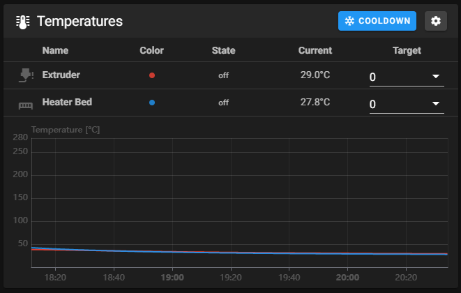

## 部件检查

### 验证温度

首先验证是否正确报告了温度。导航至 Octoprint/Mainsail 温度图。



### 验证加热器

导航至温度图表并输入 50，然后在“工具”温度目标字段中输入。图中的挤出机温度应开始升高（大约 10 秒左右）。然后转到“工具”温度下拉框并选择“关闭”。几分钟后，温度应开始恢复到初始室温值。如果温度没有升高，则验证配置文件中关于`heater_pin`的设置，并再次执行上述步骤。

### 步进电机检查

要验证每个步进电机是否正常运行，请在终端中发送以下命令：`STEPPER_BUZZ STEPPER=stepper_x`。

`STEPPER_BUZZ`命令将使给定步进器沿正方向移动 1 毫米，然后返回到其起始位置。它将执行此振荡十次。我们稍后将再次验证方向，理想情况下所有电机在测试结束时都将正确运行。请参阅下面的列表，了解每个命令的预期运动。

>注意：如果您无法看清电机的旋转方向，请尝试在皮带轮上添加一个小标记。顺时针和逆时针是从上往下看 X 和 Y 电机的视图。

| Motor      | Expectation                                                       |
| :--------- | :---------------------------------------------------------------- |
| stepper_x  | The motor will rotate clockwise first, then back counterclockwise |
| stepper_y  | The motor will rotate clockwise first, then back counterclockwise |
| stepper_z  | The front left corner of the bed moves down, then back up         |
| stepper_z1 | The back of the bed moves down, then back up                      |
| stepper_z2 | The front right corner of the bed moves down, then back up        |
| extruder   | Movement: Direction will be tested later                          |

- 如果步进电机没有移动，则回到配置文件中验证其“enable_pin”和“step_pin”两项设置。
- 如果步进电机移动但没有返回到其原始位置，则验证“dir_pin”设置。
- 如果步进电机以错误方向振荡，则通常表明该轴的“dir_pin”需要反转（通过在其数值前添加符号“!”来实现）。
- 如果电机移动明显大于或小于 1 毫米，则验证“rotation_distance”设置。

### 终点止动装置检查

确保 X、Y 或 Z 终点挡块均未被按下。然后发送`QUERY_ENDSTOPS`命令。

终端窗口应响应以下内容：

```shell
Send: QUERY_ENDSTOPS
Recv: x:open y:open z:open
```

如果其中任何一个显示“triggered”而不是“open”，请仔细检查以确保没有一个被按下。接下来，手动按下 X 终点挡块开关，并在终端中输入`QUERY_ENDSTOPS`再次发送命令，并确保 X 终点挡块显示“triggered”，并且 Y 和 Z 终点挡块保持为`open`的状态。对 Y 和 Z 终点挡块重复上述操作。

如果发现其中一个终点挡块具有反向逻辑（即，按下时显示“open”，未按下时显示“triggered”），请进入打印机配置文件找到相应配置项，添加或删除其数值前的“!”符号。例如，如果 X 终点挡块反转时，添加符号“!”在其配置项的数值前：

```text
endstop_pin: P1.28 -> endstop_pin: !P1.28
```

### XY 归位检查

重要提示：您需要在测试过程中发生任何意外情况时，能够快速停止打印机，以防出现问题（例如工具头走错方向）。以下几种方法可以做到这一点：

1. 使用显示屏上的急停按钮（如果您的打印机安装了外接显示器）。在 Mini12864 上，它是主控制旋钮下方的小按钮。一旦按钮被按下，上位机将与 Klipper 断开连接，但 OctoPrint/Mainsail/Fluidd 应该仍在运行。在终端窗口中发送`FIRMWARE_RESTART`以使打印机恢复并运行。
2. 在打印机旁边放置一台计算机，并在终端命令行中提前输入命令`RESTART`或`M112`。当打印机回零时发生错误，请快速发送重启命令，打印机将会停止。
3. 作为终极的备选方案，如果出现任何不可控的问题，可以使用电源开关关闭打印机电源。但这种行为并不推荐使用，因为它可能会损坏 SD 卡上的文件，并且要恢复需要从头开始重新安装所有内容。

正式开始测试 XY 归位：

首先，在终端中发送命令`G28 X`，这只会使 X 轴电机归位：工具头应稍微向上移动，然后向右移动，直到碰到 X 终点挡块。如果它向任何其他方向移动，则中止 X 轴测试并记录下该情况的发生，但仍继续测试 Y 轴电机。

接下来，测试 Y：在终端中发送命令`G28 Y`：工具头应移至打印机后部，直至碰到 Y 限位器。在 CoreXY 配置中，两个电机都必须移动才能使工具头仅沿 X 或 Y 方向移动。如果龙门架在向右移动之前先向下移动，则必须在配置中反转 Z 轴步进电机的方向。

- 如果需要反转其中一台电机的方向，请通过为数值前添加符号“!”来反转方向引脚定义。例如，`dir_pin: PB2`会变成`dir_pin: !PB2`。（反之则删除符号“!”）。
- 如果电机的运行方向与图表下排相匹配，请物理交换 MCU 上的 X 和 Y（A 和 B）电机连接器。
  - [stepper x] = Motor B
  - [stepper y] = Motor A

### 热床定位

Z 轴限位器应尽可能靠近最大 Y 位置。在终端中发送命令`G28 X Y`将 X 和 Y 轴电机归位，然后仅移动 X 以在最大 Y 行程处找到 Z 终点限位器位置，该位置仍将触发终点限位器。最终将 Z 轴限位器锁定在该位置。

一旦 Z 端止动装置固定到位，应调整底板，使 Z 止动装置销距铝制底板约 2~3 毫米。

### 热床调平

在终端中发送命令`Z_TILT_ADJUST`，程序将自动为您调平热床。

### 挤出机校准

在第一次打印之前，请确保挤出机挤出正确数量的材料。

- 首先，确保挤出机运行方向正确：加热热端，挤出 10mm 左右的长丝：
  - 如果挤出机将细丝拉入，则一切顺利。
  - 如果灯丝被从顶部推出，请在配置文件“Printer.cfg”中找到`[extruder]`选项部分，在`dir_pin`选项值前添加符号“!”以反转挤出机。（反之则删除符号“!”）
- 当热端处于一定温度时，在长丝卷和挤出机之间的长丝上做一个标记，距离挤出机入口 120 毫米到 150 毫米之间。测量从挤出机入口到该标记的距离。
- 在 Octoprint / Mainsail 中，将挤出速度设置为 1 mm/s，并分 2 次挤出 50 mm（总共 100 mm，因为 Klipper 不允许一次挤出超过 50 mm）。
- 测量从挤出机入口到您之前所做的标记的距离。

>在理想情况下，假设标记为 120 毫米，则测量结果为 20 毫米（120 毫米 - 20 毫米 = 100 毫米），但通常情况并非如此。

- 使用以下公式更新`rotation_distance`配置文件的挤出机部分：新配置值 = 旧配置值 *（实际挤出量/目标挤出量）

注意：配置值越高意味着挤出的细丝越少。

将新值粘贴到配置文件中，重新启动 Klipper，然后重试。一旦挤出量在目标值的 0.5% 以内（即，对于挤出长丝的目标 100 mm，为 99.5~100.5 mm），挤出机就被校准成功了！

## 选择切片软件

只要您的打印机配置正确，所有现代主流切片软件都能够生成出高质量的打印件。

内置：

- Cura
- SuperSlicer

其他：

- PrusaSlicer
- OrcaSlicer
- Simplify3D
- Slic3r

某些切片软件（例如 PrusaSlicer）无法将宏`KlipperPRINT_START`识别为有效的启动宏，并在启动 gcode 时添加额外的床加热和喷嘴加热。例如切片软件输出 gcode 时，其代码中“PRINT_START”相邻行存在关键字“M109”或“M190”。请考虑使用其他的切片软件或更新现有切片软件的版本来将该宏识别为有效的起始宏。

## 打印前预热

为了获得最高的质量和准确性，建议对打印机进行预热和均热。这可以是脚本化流程的一部分，也可以单独完成。强烈建议预热至少 10 分钟，以使所有组件达到热膨胀平衡（均热）。该时间可能会有所不同，具体取决于许多因素，包括打印机和床加热器的尺寸。

经测试，尺寸为 350x350x350 mm 的 Voron2 加热一小时后高度膨胀 0.2 mm。

每台打印机都会有一个启动顺序，通常涉及回零或调平以准备打印机。这是除了加热喷嘴和床以及执行其他任务之外的任务。查看配置文件“Printer.cfg”中`PRINT_START`的部分以了解标准流程。有关其他信息或想法，请查看[有关“宏”的详细配置](https://docs.vorondesign.com/community/macros/)。

## 首次打印

从 [Voron 官方仓库](https://github.com/VoronDesign/Voron-2/tree/Voron2.4/STLs/Test_Prints) 中下载 [沃龙方块](https://github.com/VoronDesign/Voron-2/blob/Voron2.4/STLs/Test_Prints/Voron_Design_Cube_v7.stl) 或任何您喜欢的打印件“配方”。然后在您的切片软件中打开该文件，对于 ABS 材料，将热端加热至 240 °C 、热床加热至 100 °C，并设置流量为 92%，将带来较好的打印效果。其余选项保持切片软件的默认设置。

将切片软件生成的 .gcode 文件保存到桌面。在 Web 浏览器中导航到 Octoprint、Mainsail 或 Fluidd，然后上传该文件。按下“打印”按钮并仔细观察打印的开头。如果您的喷嘴离床太远或太近，请在打印机显示屏上按下旋钮，导航至“Tune（调谐）”，然后调整 Z 轴偏移距离（“+”代表距离热床更远，“-”代表离热床更近）。

属于您的 3D 打印之旅已经开启。
