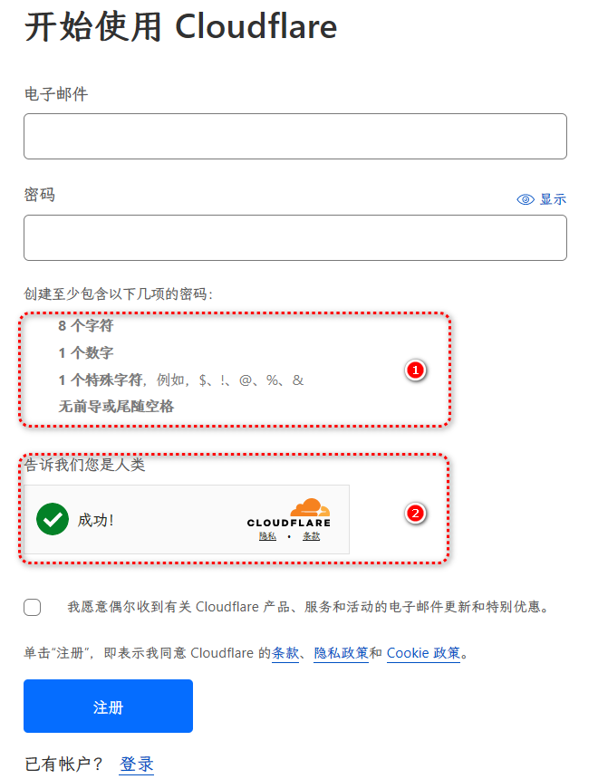
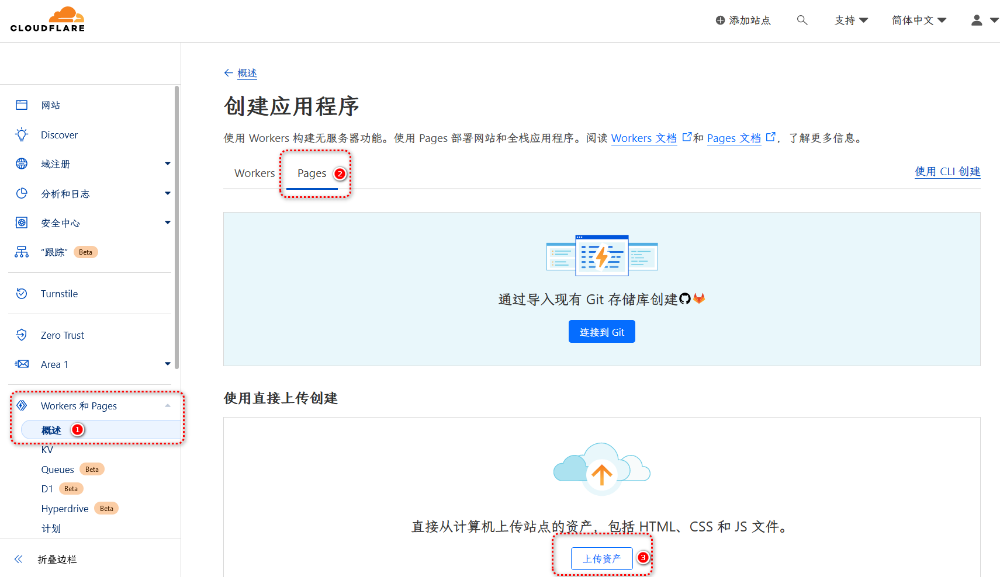

>注意：本篇文章仅适用于 Cloudflare Pages 与 Docsify 联动使用的情况，其他开源框架工具均需要编译后再上传。

## 创建 Cloudflare 账号

进入 [Cloudflare](https://dash.cloudflare.com/sign-up/zh-CN) 注册页面进行账号注册。

>提示：
>
>①，Cloudflare 对用户的密码强度要求较高，请确保密码是否符合这四项要求。
>
>②，由于可能存在的网络问题，此处验证码若无法加载或显示的不为“✅”，请刷新页面重试。

## 开通 Cloudflare Pages 服务并上传项目文件

登录后依序，`首页`-`Workers 和 Pages`-`创建应用程序`-`Pages`-`上传资产`，跳转到 Cloudflare Pages 的创建页面。

在点击`上传资产`按钮后将跳转到项目的创建页面，按照网页上的要求完成相应步骤即可实现网站的托管与部署工作。

>提示：
>
>项目的名称将同时作为第三级域名成为最终网站域名的一部分使用。
>
>例如使用`mydocs`作为项目名称时，最终网站域名为`mydocsify.pages.dev`。
>
>若项目名称过于简单或为人熟知，极有可能存在与已有网站重名的情况。此时 Cloudflare 将自动为你的网站域名添加一部分随机字符以确保其唯一性，如`mysite`与`mysite-66j.pages.dev`。若想避免此种情况的出现，请尝试更换项目名称。

完成部署后的几分钟内或许你无法访问到自己的网站，出现这种情况是正常的。因为你的网站拥有一个新诞生的域名，它在互联网上的传播需要一定的时间，若 Cloudflare 没有提示存在任何其他的错误，耐心等待即可。

至此，你以完成使用 Cloudflare 与 docsify （A3+B1）方案的建站教程，更多使用技巧可以参阅 [Cloudflare Pages 官方教程](https://developers.cloudflare.com/pages) 和 [Docsify 官方教程](https://docsify.js.org/#/zh-cn/)。
