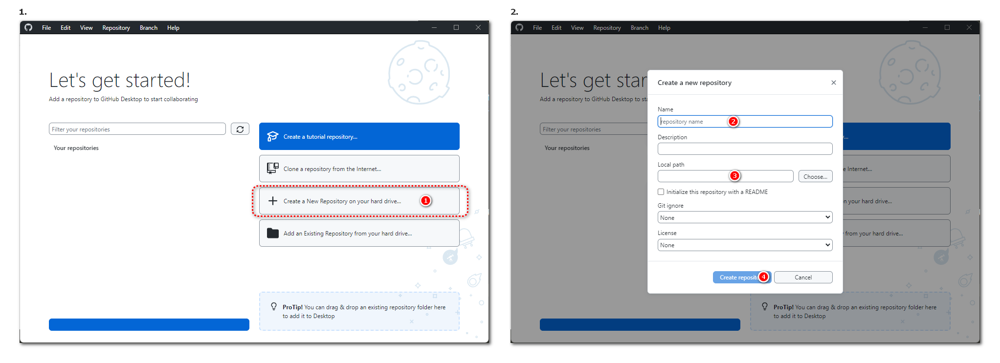
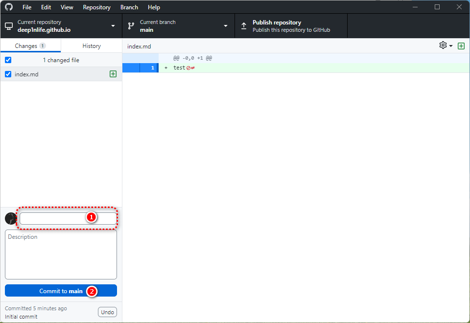
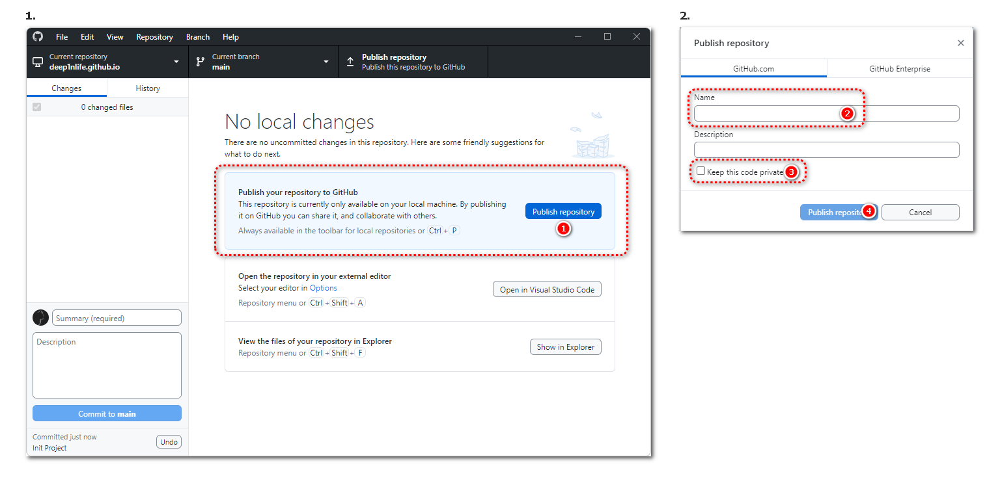

>注意：本篇文章仅适用于 GitHub Pages 与 Jekyll 联动使用的情况。其他框架工具请阅读官方文档中关于 GitHub Pages 部署的部分。

## 创建本地仓库

选择在本地硬盘上创建仓库，仓库名称填入`你的用户名.github.io`（如`zhangsan`与`zhangsan.github.io`），选择任何你想存放在本地的文件夹位置，点击创建即可完成。

## 初始化仓库内容

在文件管理器中打开仓库文件夹，新建`index.md`文件，作为网站首页将要展示的内容。

使用记事本打开`index.md`文件，输入任意文档内容。

>提示：`.md`文件，即`Markdown`格式在内容的编排上使用一套特有的 [语法规则](https://www.markdownguide.org/basic-syntax/)。但请放心地在此处输入任何内容，除了文档可能会在样式上发生错乱外不会产生任何其他后果。

完成文档内容的编辑后回到 GitHub Desktop 应用界面。此时你将注意到应用中显示了刚才对`index.md`文件所做出的所有更改。接下来完成我们项目的首次“提交”工作，以生成项目快照，上传到托管平台。

在标号①处输入一些文本用来描述本次“提交”（便于记录与后期查验工作），在标号②处点击“提交”。

>提交，对应的命令为`commit`，是生成项目快照与保存当前工作进度的唯一方式，今后我们会频繁的用到它。只有提交操作后才会产生快照，有了快照才能继续进行接下来的一系列操作。

## 发布文档与自动部署

提交过后我们就可以将本地仓库上传至 GitHub 平台：

1. 在标号①处点击“Publish Repository”。
2. 再次确认标号②处的仓库名称符合`你的用户名.github.io`的形式（如`zhangsan`与`zhangsan.github.io`）。
3. 在标号③处取消选择选项“Keep this code private”，使仓库成为公开可访问的状态。
4. 在标号④处点击发布。

>今后我们将在这个页面完成更新本地项目（pull）或推送更新到平台（push）的工作。

完成发布后，GitHub 将在后台为我们自动地完成一系列编译工作（使用`Jekyll`框架生成页面）并为我们这个名称特殊的仓库打开 GitHub Pages 服务，网址为我们反复提及的格式`你的用户名.github.io`（如`zhangsan`与`zhangsan.github.io`）。

发布后的几分钟内或许你无法访问到自己的网站，出现这种情况是正常的。因为你的网站拥有一个新诞生的域名，它在互联网上的传播需要一定的时间，GitHub 也会将构建结果发送到你的邮箱中，耐心等待即可。

至此，你以完成使用 GitHub Pages 与 Jekyll（A1+B2）方案的建站教程，更多使用技巧可以参阅 [GitHub Pages 官方教程](https://docs.github.com/zh/pages) 和 [Jekyll 官方教程](https://jekyllcn.com/docs/home/)。

## 拓展阅读

使用 GitHub 管理项目，并跑通所有网站托管服务商：

GitHub 是全球知名的在线代码托管平台，故主流的网站托管服务商都具备一键从 Github 拉取项目并部署网页的功能。

当我们完成 Github 仓库的上传后，在本文档中所有提及的网页托管服务商处创建网站时，都可以选择 GitHub 的这个仓库作为文件来源，不再需要我们手动上传项目文件夹。极大的便利了网站的创建与迁移工作，甚至可以做到一次更新多站同步的效果。

无论我们选择何种搭配方案，都可以使用 GitHub 作为项目管理的工具，快捷地部署到各个网站托管服务商，并实现近乎无感地内容同步。
