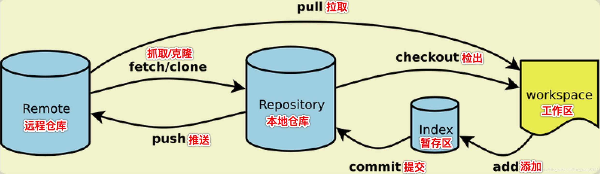
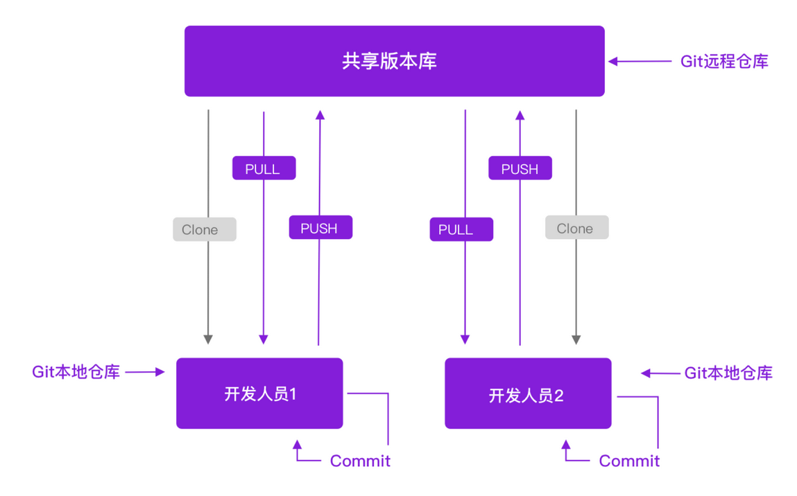
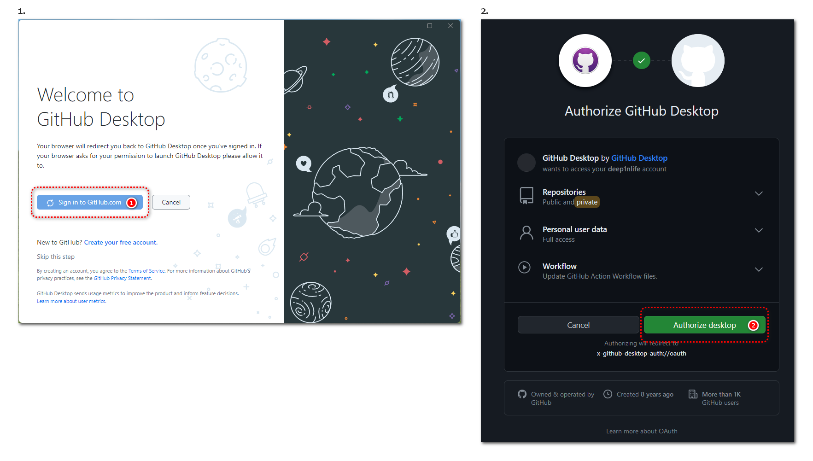

## 前言：什么是 Git

这并不是在玩文字游戏，把它们拆开来讲是因为包括 GitHub 在内的 Gitee、Gitlab 和 Bitbucket 等一众在线代码项目托管平台都由`Git`工具衍生而来，也是我们使用这些平台的主要方式。

`Git`是一个开源的分布式版本控制系统。为什么它很重要？它能为我们的项目带来什么帮助？

### Git 与分布式开发

当我们的文档开发遇到如下情景时：

- 开发人员超过 1 人
- 用于开发的设备超过 1 台

一定会遇到项目文件的流转与同步问题，通过`Git`我们可以很方便的为我们的本地项目设定一个上游“仓库”，一键式地完成拉取（更新本地）与推送（更新上游）工作并确保数据的完整与一致性，实现项目的并行开发与协作。当然，诸如同步网盘之类的工具也能很好的无感的完成这项工作，但`Git`除此之外还具备着强大的版本控制功能。

>在`Git`工具的概念中，一个项目被称作“仓库”。因为它需要额外创建一些文件来记录和管理整个项目，这些文件被存放在项目文件夹下名为`.git`的隐藏文件夹中。经过`Git`初始化后的项目文件夹就成了一个仓库。
>
>上游仓库一般被设定为我们在线代码项目托管平台中创建的仓库，文件通过托管平台这个第三方在各个开发人员的设备上流转。

### Git 与版本控制

通过`Git`我们能够轻松地为整个项目生产一个快照，保存着当前所有文件的内容与项目的状态，这意味着：

- 可以记录和回溯所有更改
- 可以设定不同的项目分支，便于实现文档开发与文档发布的环境隔离等需求

## 什么是 GitHub

`GitHub` 是一个基于 Git 的在线代码项目托管平台，主要的特点和功能包括：

- 项目托管：可以创建自己的项目仓库，将本地项目上传至仓库中后，便可在线地存取与使用它们。
- 项目协作：`GitHub`为我们提供了评论、问题跟踪、代码提交与代码合并等功能，可以通过这些功能进行项目的合作和交流。
- 便捷的客户端：通过`GitHub`提供的 GitHub Desktop 工具，我们可以很方便的使用 Git 管理本地项目与使用`GitHub`平台。

## GitHub 的注册

>注意：GitHub 平台的网站托管服务将使用你的用户名作为第三级域名，如用户名为`zhangsan`时对应的网站域名为`zhangsan.github.io`。所以在注册账号时不要随意地输入用户名。

打开 [GitHub](https://github.com/) ，在首页输入邮箱并完成邮件验证即可注册成功。

## 使用 Github Desktop 并创建项目与在线仓库

点击 [链接](https://central.github.com/deployments/desktop/desktop/latest/win32) 下载 GitHub Desktop。

完成安装后打开 GitHub Desktop 应用程序。

点击登录按钮将跳转到浏览器中，等待你授予其访问你 GitHub 账号的权限。

至此，GitHub 平台的基础使用工作已经完成，下一步进行 [Jekyll 项目的初始化与部署工作](content/software/publish-your-site/examples/github-pages.md)。
